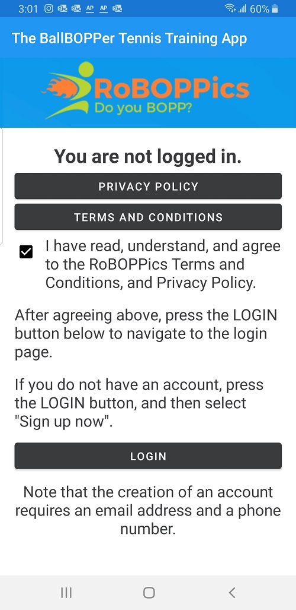
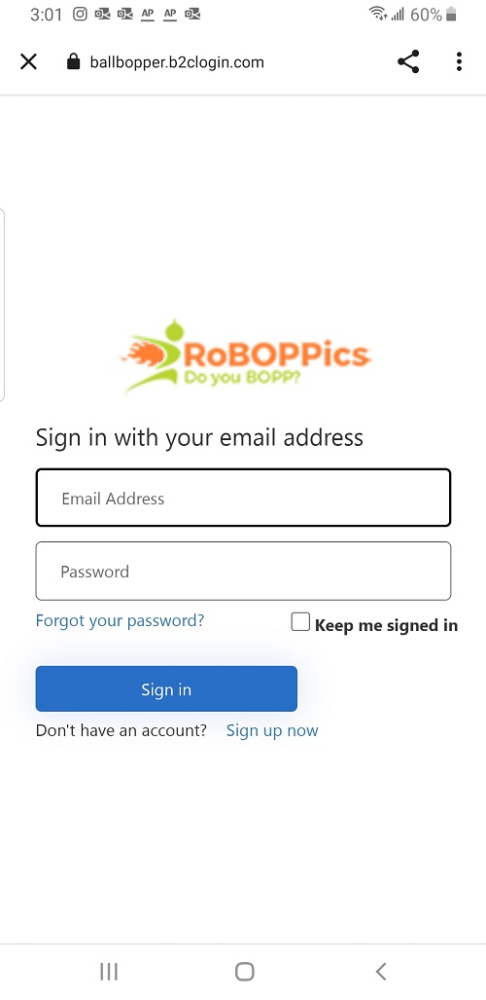

Privacy Policy, and Terms and Conditions
=====

When you first launch the BallBOPPer app, you will be presented with the following page.

Clicking on the Privacy Policy and Terms and Conditions buttons will open these documents in a browser for you to read.

If you are in agreement with the Privacy Policy and Terms and Conditions, then check the box. Then click on the Login button.

 
.. loginpage:

Login Page
------------

The first time you arrive at the login page, you will need to create an account. Click on "Sign up now".

After you create your account, enter your Email Address and Password to log in.

After confirming your email address, you will need to enter your phone number in order to recieve a confirmation text.

By checking the "Keep me signed in" box, you will only rarely need to sign in. Most of the time you will be logged in automatically.
