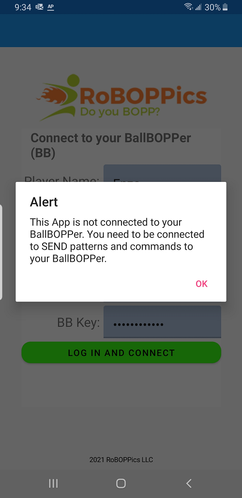
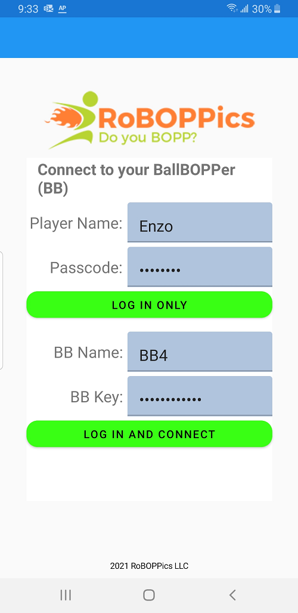

Connect
=====

When you first launch the BallBOPPer, you will see the alert shown below indicating that you are not currently connected to your BallBOPPer. 

 
You then have two options: Log In Only, and Log In and Connect.

 
.. loginonly:

Log In Only
------------

"Log in Only" lets you log in, using your Username and Password, without connecting to your BallBOPPer. 

You can create your Username and Password on the RoBOPPics site. 

This allows you to create and edit your Drills, Patterns and Playlists from whereever you want: at home, on the train, or during a break at work. 

.. loginandconnect:

Log In and Connect
------------------

"Log in and Connect" is for when you are on-court and ready to play. 

You will need your Username and Password, along with the name of your BallBOPPer and the ID for your BallBOPPer.

The name and ID of your BallBOPPer will be shown in the User Manual that you recieve with your BallBOPPer.

After you enter this information once, it will be remembered by the App. The only time you will need to reenter it is when you change phones, or reinstall the App.
